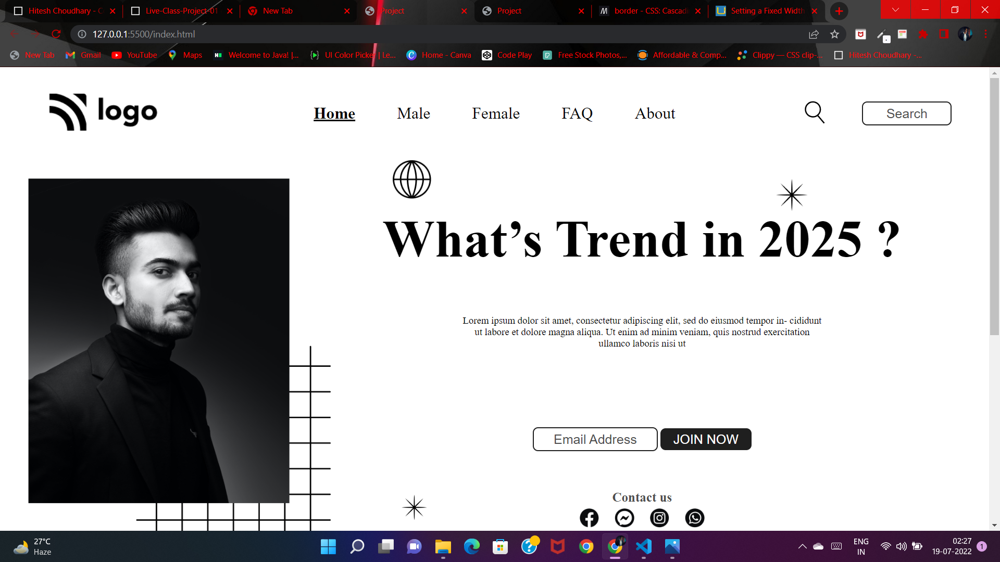

# Street Style Landing Page
> Project -1 Design by **Abhishek Bhuyan**

<table>
      <th>
        <tr>Aim</tr>
      </th>
      <tbody>
        <td> To build a Static landing page Purly using HTML & CSS</td>
      </tbody>
</table>

### Learning outcome
- creating Navbar using Css flexbox.
- Get a lucid idea about selector in css.
- Able to understand about svg file.
- Image poistioning uisng CSS positioning

### Device Support
 This staticpage is compatible with **desktop screen only**,I will definetly make this webpage responsive verry soon. 

### Project View

### Demo

### Autor

### Contact
- [LinkedIn](https://www.linkedin.com/in/abhisekh-bhuyan-5605b3230/ )

- 
